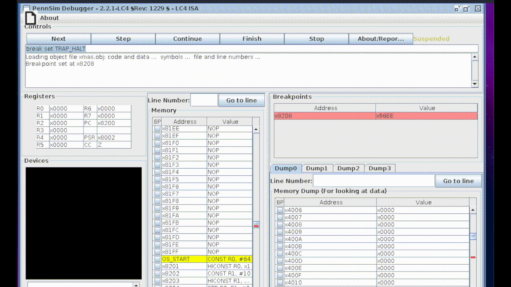

# j-Compiler

This is a project that converts the stack-oriented language J into assembly.


*demo of compiler on factorial function*


### Run this Project

**Clone the Repo**

``` git clone https://github.com/gracejiang/jcompiler ```


**Navigate into the Repo**

```cd jcompiler```


**Compile the Files**

``` make ```


**Then, to compile a .j file, run the following**

```./jc filename.j```


### Bonus

Merry Christmas! :-)



